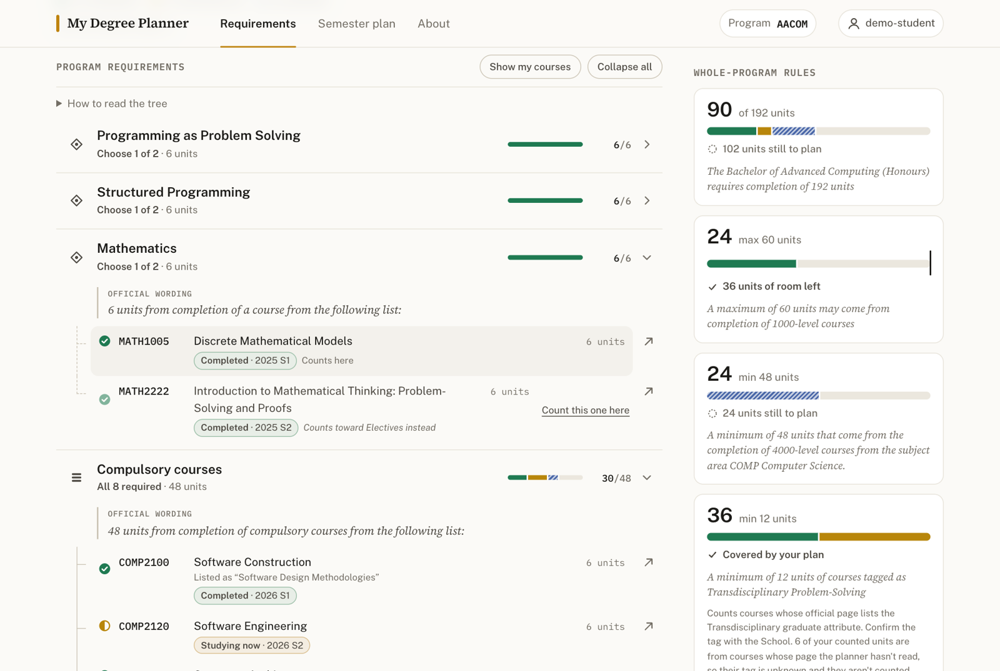
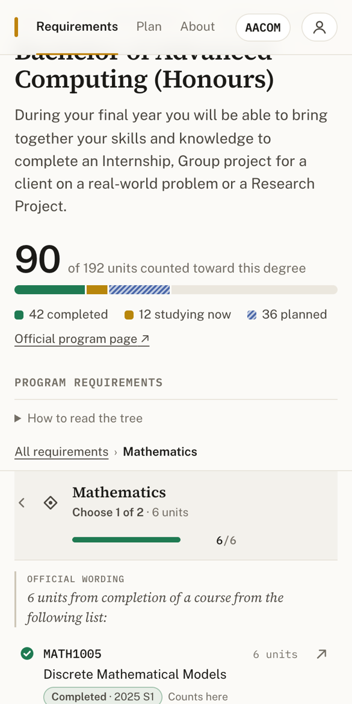
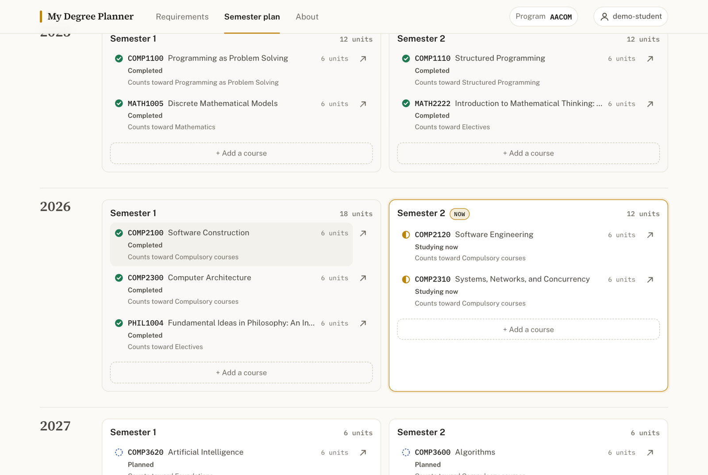

# My Degree Planner

ANU's Programs & Courses pages hold everything a Computing student needs to know
about their degree, but the Program Requirements section is a long block of
text: nested "6 units from the following list", "one of the following
specialisations", "Either … OR … AND …", plus whole-program rules like "a
maximum of 60 units may come from 1000-level courses". My Degree Planner turns
that text for four standalone 2027 Computing programs into an interactive
requirements tree. It then lays the student's own record over it: courses
completed, being studied now, and planned for a future semester. The same plan
is also shown as a semester-by-semester timeline. Each student has a private
My Degree Planner account and plan. It is a planning aid built on the official
catalogue, not a degree audit.



## What good looks like here

**Every academic fact is official, and traceable.** Everything comes from the
2027 ANU Programs & Courses catalogue, read on 27 September 2026:

- the four programs (BCOMP, AACOM, AACRD, AENSE)
- the seven majors and five specialisations they point to
- the 98 courses they name

The plain-text extracts, each with its source URL, are committed in
`research/2027/`. Two further official sources sit alongside them:

- **The full course list.** Every 2027 undergraduate course (1,523 of them) is
  in `ug-catalogue.json`, taken from the JSON behind the catalogue's own search.
  That list is the only thing a plan can contain. A code that isn't in it, such
  as COMP0721, is refused rather than shown as an unverified course with a link
  to a 404.
- **Detail from each named course's own page.** For the 98 program courses:
  - the unit value
  - the 2027 offerings
  - the graduate attributes
  - the official incompatibility sentence
  - whether the page says the course runs over two consecutive semesters

Every requirement group shows its official sentence word for word, and the short
title above it is only a navigation label. Where sources disagree, the app shows
both. The program page lists COMP2100 as "Software Design Methodologies", its
course page says "Software Construction", and the leaf carries both. The Machine
Learning specialisation is listed in the 2027 AACOM requirements but has no 2027
page, so its structure comes from the 2026 page, and the node says so.

**Hierarchy one level at a time, with a visual grammar for "and" and "or".**
Nothing is expanded when the page loads. Each group has a glyph, a plain-words
relation ("All 8 required", "Choose 1 of 2", "At least 12 units", "Up to 12
units · optional", "One pathway", "Any 18 units"), and a connector line whose
style repeats the relation: solid when every child is needed, dashed when you
choose among them, dotted for an open "any course that fits" requirement.
Pathways (specialisations, majors, the AACOM final-year options) are cards. The
one you choose is marked, and the others show what they *would* hold if chosen.
On a phone the tree becomes a drill-down: one group's children fill the screen,
with a breadcrumb trail back up.



**Every course leads to its official page.** Every course anywhere in the tree
or the semester plan links to
`programsandcourses.anu.edu.au/2027/course/<CODE>`. Every code comes from the
verified list, so every link resolves.

**A private plan, one record per course, one calculation.**
- **What's saved:** a student picks a program, then records each course as
  Completed, Studying now or Planned, with a year and session. The chosen
  program, every entry, every pathway choice and every choose-one selection are
  rows in SQLite belonging to that student's account.
- **One record per course:** a course is in a plan once, enforced by
  `UNIQUE(user_id, course_code)` in the database, not only by the interface.
  Adding it again explains where the existing entry is and offers to move it.
- **Two-semester courses:** a course its page says runs over two consecutive
  semesters (COMP3500, COMP3770, COMP4500, COMP4550, ENGN4300, ENGN4350) is
  still one record. It appears in both of its semesters.
- **Two views, one set of numbers:** the requirements tree (`/`) and the semester
  plan (`/plan/`) read the same evaluation, so the headline, every tree node, the
  whole-program rules and the semester summaries always agree.



### How progress is counted

Taking a course and having it satisfy a requirement are different things, and
the tree shows both. Each course record credits **at most one** requirement,
never more units than that requirement or any group around it can hold. Credit
is given in this order, across the part of the tree in play (chosen pathways
only):

1. compulsory courses
2. exact "choose" lists
3. "at least" bands
4. "up to" bands
5. open requirements with a filter ("18 units of 3000/4000-level COMP")
6. unrestricted electives

A course goes whole into the first open requirement with room for it, and never
splits across two. In a choose-one list such as "Choose 1 of 2 · MATH1005 /
MATH2222", only one course counts, and the other shows "Counts toward Electives
instead". The student can switch which one counts ("Count this one here"); the
server checks the requirement, the option and that the course is in their plan.
Where the official course pages say two alternatives are incompatible (COMP1100
and COMP1130, for example), the second can't be added at all, and the panel
quotes the page's sentence and points to the course already in the plan.

**Whole-program rules sit beside the tree.** Total units, the 1000-level
maximum, the COMP level minimums and the Transdisciplinary Problem-Solving
minimum are quoted in full and measured against the units that count toward the
degree. Rules the planner deliberately doesn't evaluate are listed separately:
the AACRD 75%/80% WAM progression rules and the honours calculations.

### What's refused, and what's only flagged

| Refused (a data-integrity or policy impossibility) | Flagged, still saved (possible with approval, or a slip) |
| --- | --- |
| A second record for a course already in the plan | Completed, but placed in a semester that hasn't finished |
| A course officially incompatible with one in the plan | Planned for a semester that has passed |
| A code that isn't in the 2027 undergraduate catalogue | Studying now, but not in the current semester |
| Units outside the course's official range | More than 24 units in a study period (the standard load; overload needs approval) |
| A two-semester course starting outside Semester 1 or 2 | A 2027 session the catalogue doesn't list for the course |
| More than 36 units in one study period (ANU policy never permits it) | |

The load limits come from the ANU *Student academic study load and progression*
policy (`research/policy-study-load.txt`): clause 12 sets a standard load of 24
units in a study period, and clause 20 says permission is never given for more
than 36. The server returns each refusal with its own status and a plain
message, and the course panel shows the same checks live as the student
edits:

- 400 for invalid input
- 401 when the session has ended
- 404 for an unknown course, or an entry that isn't in your plan
- 409 for a duplicate or an incompatible course
- 422 for a policy block

### Accounts and privacy

**This is a My Degree Planner account, not your ANU account. Never enter your
ANU password here.**

- **What an account is:** a username and password that exist only in this app.
  Nothing imitates the ANU sign-in, and a student number is never used as
  identity.
- **How passwords are kept:** salted scrypt hashes, never in plain text.
- **How sessions work:** a random token in an HttpOnly, SameSite cookie. The
  database stores only its SHA-256, and failed log-ins are throttled per
  username.
- **Who a request acts for:** every route learns the user from that session,
  never from anything the browser sends. Every query, mutation, reset and
  live-update event is scoped to that account. Asking for someone else's entry
  by id is simply "not found".

Before accounts existed, every visitor shared one anonymous demo user. Its data
couldn't be attributed to anyone and included duplicates and a fabricated code,
so migration `0003` clears it. The migration trail was checked against a copy
of that production data before deploying.

### Where it stops

- a planning estimate, not an audit: prerequisites, marks, timetables and
  eligibility are not modelled
- a two-semester course has one status for both semesters
- local rules inside majors and specialisations ("a maximum of 18 units may come
  from 1000-level courses", incompatibilities between a major and a
  specialisation) are shown as notes, not checked
- detail such as the Transdisciplinary attribute, incompatibilities and
  variable unit ranges is only known for the 98 courses whose pages were read.
  For the rest the catalogue listing gives title, units and sessions, and the
  Transdisciplinary count says when a tag is unknown
- study history is entered by hand

What was left out on purpose: combined and double degrees, every other ANU
program, course recommendations, prerequisite checking, timetable clashes, GPA,
financial information, enrolment, and any ANUHub or ISIS access. Reading a
student's results automatically would need an officially approved ANU
integration; there is no public interface for it, and this app never asks for
ANU credentials. A possible future step would be importing a Statement of
Results with the student's explicit consent, extracting only course codes and
terms and keeping neither the document nor the marks. That is not built.

## What's enforced, and what's judged

`pnpm check` holds the mechanical promises:

- `spec/degree-planner.test.ts` drives the running server over HTTP:
  - signed out: the landing page carries the account notice, private pages
    redirect to log in, and the API answers 401
  - accounts: weak passwords and taken usernames are refused, the right password
    logs in, and logging out ends the session
  - two accounts see only their own program and courses, can't edit or delete
    each other's entries, reset only their own plan, and receive only their own
    live updates
  - one record per course: a duplicate gets 409 and says where the original is;
    moving it works; incompatible courses and unknown codes are refused
  - editing between statuses and removing update both views, and each bad edit
    gets its own status and code
  - study-load warning and limit
  - choose-one credit and selection
  - the headline equals the whole-program total
  - collapsed groups, official links on every course in all four trees, and an
    accessibility floor on the populated pages
- `spec/requirements.test.ts` checks, without a server:
  - the verified catalogue: 1,523 courses, two-semester evidence,
    incompatibilities, and whole quotes
  - the transcription arithmetic: each program adds up to 144 or 192 units, and
    every fixed group to its official units
  - the allocation rules above
  - the consistency checks
  - password hashing
- `spec/invariants.test.ts` covers `/`, `/login/`, `/signup/` and `/readme/`,
  and `spec/readme.test.ts` checks this page is served in full.

`pnpm e2e` (`e2e/planner.e2e.mjs`) drives a real browser against a running
server through the flows only a browser can show: two accounts, duplicate
then move, editing, Remove with Undo, choose-one switching, incompatible and
unknown courses, an offline save, focus returning after Escape, the program
switcher's accessible names, a scoped reset, logging out and back in, and the
mobile drill-down with reduced motion.

What only a person can judge: whether the tree is genuinely easier to follow
than the official text, whether "counts here / counts toward … instead" makes
the difference between taking and counting clear, whether the motion explains
structure rather than decorating it, and whether the look is calm and
recognisably ANU without imitating its site.

## Running it

```sh
mise install
pnpm install
pnpm dev      # http://localhost:4321
pnpm check    # types, build, and every spec above
BASE=http://localhost:4321 CHROME="/path/to/chrome" pnpm e2e
```

The schema lives in `src/lib/schema.ts` and its migrations in `drizzle/`,
applied at boot. Reference data (courses and programs) is re-seeded from
`research/` and `src/data/` on every boot, and personal tables are never touched
by the seed.
